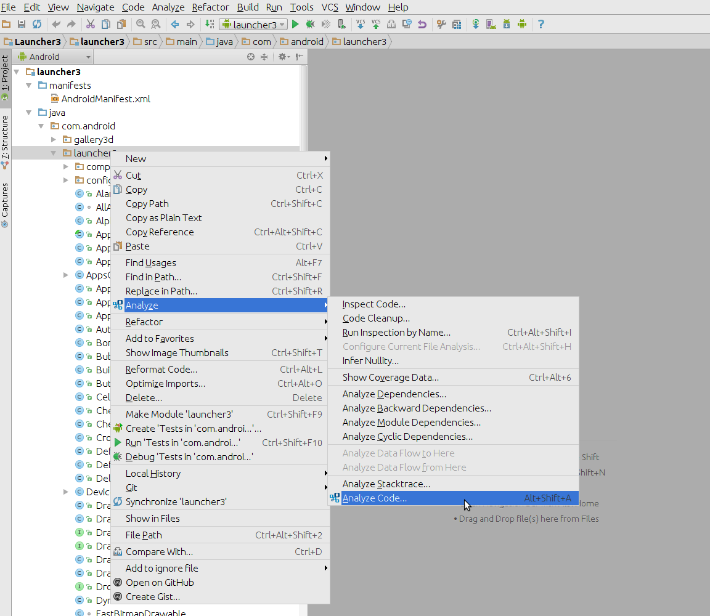
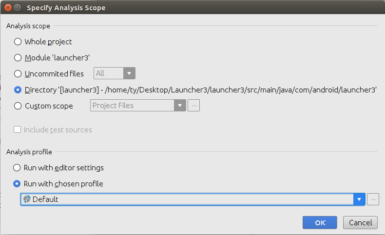
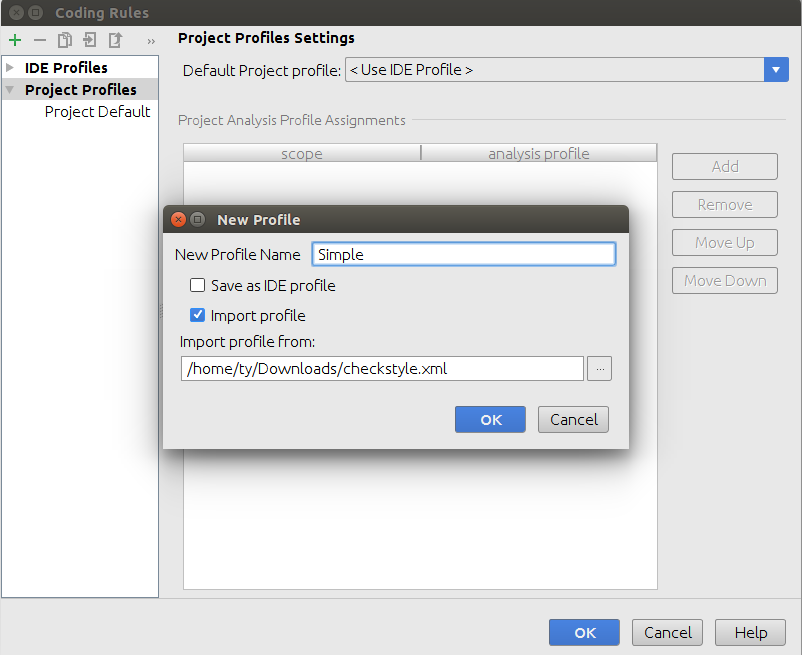
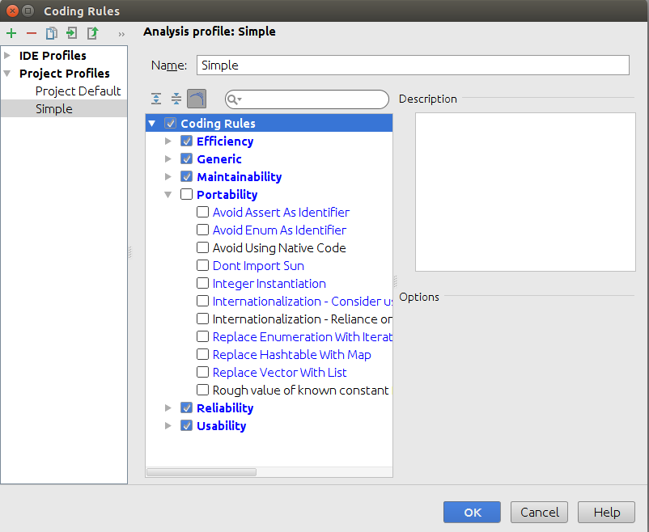
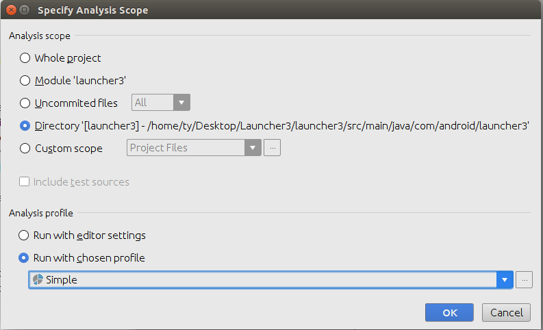
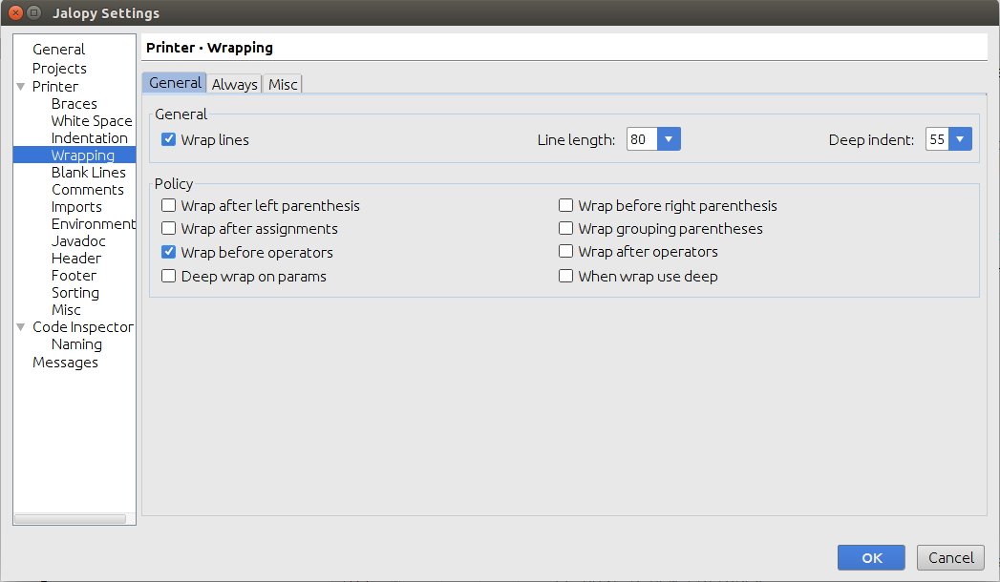

Code Check
==========

refer:
-  http://vincentbrison.com/2014/07/19/how-to-improve-quality-and-syntax-of-your-android-code/

Code Quality Analysis Tools
---------------------------

### Check Style

refer:
- [Android Code Style](http://source.android.com/source/code-style.html)
- [Sun Java Code Style](http://www.oracle.com/technetwork/java/javase/documentation/codeconvtoc-136057.html)
- [Google Java Code Style](http://google.github.io/styleguide/javaguide.html)

### Findbugs

refer: http://findbugs.sourceforge.net/

### PMD

refer: https://pmd.github.io/

### Android Lint

refer: http://developer.android.com/tools/debugging/improving-w-lint.html

Android Studio Tools
--------------------

### Android Studio Plugin: QAPlug - code quality analysis

refer: http://qaplug.com/about/tutorials/

**Step1: Install QAPlug plugin**

Basically, following two plugins is required for running checkstyle:
* QAPlug
* QAPlug - checkstyle

But if you want to improve yours code with high quality, the *QAPlug - FindBugs* and *QAPlug - PMD* plugins are suggested.

>> Hint: Qlauncher3 has 1223 problems that violate the PMD rules. So, I thinks the PMD Plugin is better to have, but not necessary.

**Step2: Analyze your module with custom checkstyle rules**

Right click on the module/folder that you want to analyze.

Specify Analysis Scope

Import rules from file. [example file](files/simpleCheckstyle.xml)

Set your custome rules.

Run with your custome checkstyle rules

### Android Studio Plugin: Jalopy - format code with custom rules.

**Set up Jalopy format rules:**

`Code` --> `Jalopy Settings`

**Usage:**

Open the java file, Use `Ctrl+Shift+P` to format currently active document,

or alternatively, enable automatic formatting on save in plugin configuration.

The Gradle/Command Way
----------------------

### run custom checkstyle.

refer:
- https://medium.com/@LiudasSurvila/writing-checkstyle-rules-with-android-studio-b1d31b30ca3a
