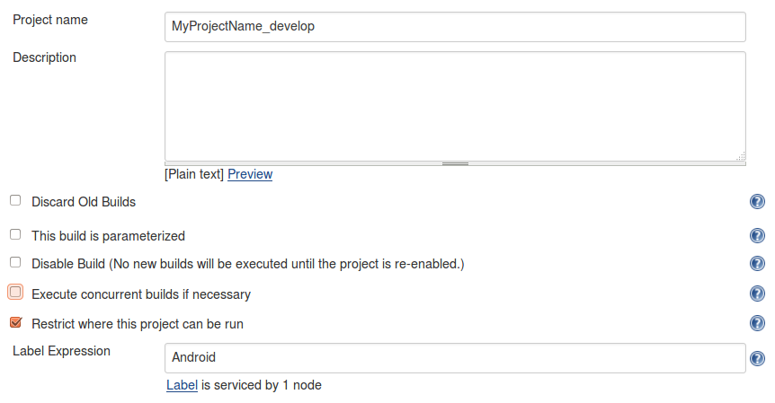
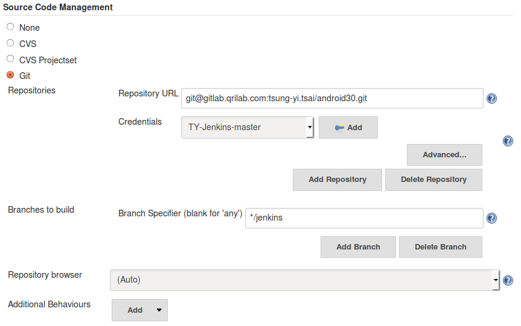
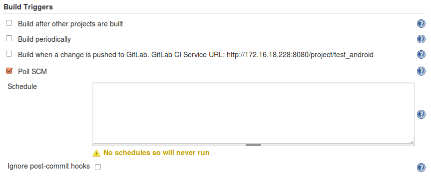
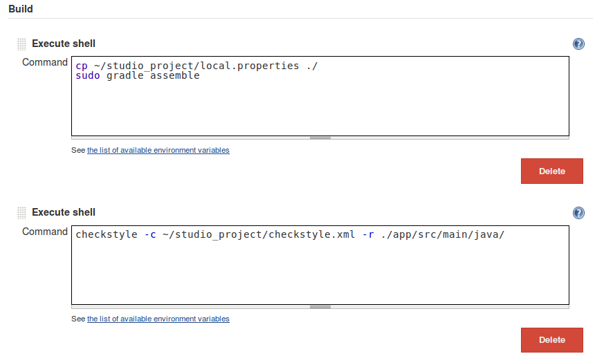
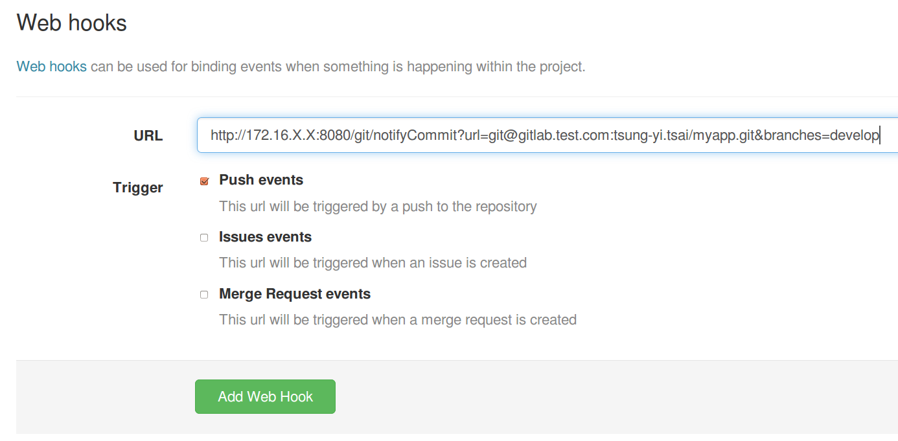
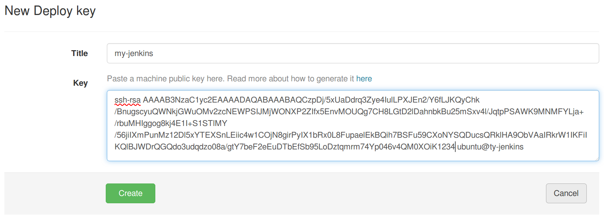
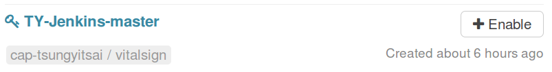
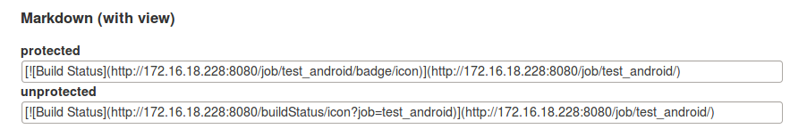
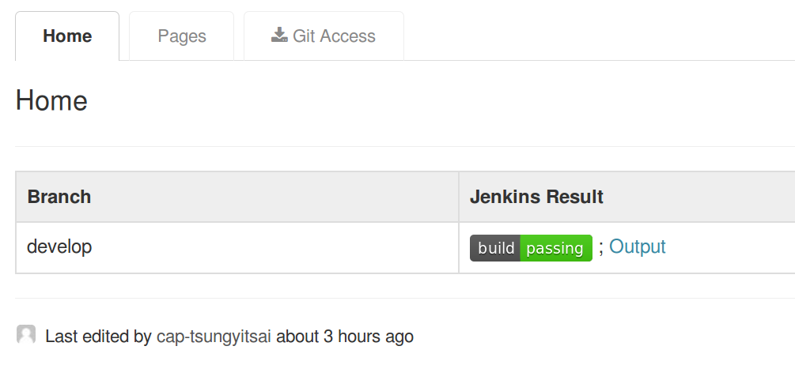

Gitlab + Jenkins
=================


Install Gitlab
--------------

please refer:
- https://about.gitlab.com/downloads/#ubuntu1404


Install Jenkin Server
-------------------------

**install jenkins:**
- https://wiki.jenkins-ci.org/display/JENKINS/Installing+Jenkins+on+Ubuntu

apt-get install git


**install plugins:**

- Git Client plugin
- Git Parameter Plug-in
- Git plugin
- embeddable-build-status


Set up Jenkin Slave Nodes for android testing
---------------------------------------------------

### Install git & java sdk

**Install Java JRE & Oracle JDK:**

refer: https://www.digitalocean.com/community/tutorials/how-to-install-java-on-ubuntu-with-apt-get

**Install git:**

    $ sudo apt-get install git


### Install android sdk

    $ wget http://dl.google.com/android/android-sdk_r24.3.4-linux.tgz

    $ tar zxvf android-sdk_r24.3.4-linux.tgz

    $ cd android-sdk-linux/tools
    $ sudo ./android update sdk -u
    $ sudo ./android update sdk -u --all --filter build-tools-21.1.2

If you working on UBUNTU 64 Bit: You have to install these packages to solve errors because Android SDK still support UBUNTU 64 Bit.

    $ sudo apt-get install lib32stdc++6 lib32z1


Declare the sdk path:

created a file called local.properties and put inside

    sdk.dir=/path_to/android-sdk-linux

Or

    export ANDROID_HOME=/path_to/android-sdk-linux

### Install gradle

refer: http://linuxg.net/how-to-install-gradle-2-1-on-ubuntu-14-10-ubuntu-14-04-ubuntu-12-04-and-derivatives/

<br>
**Gradle Usage:**
- [Gradle User Guide](https://docs.gradle.org/current/userguide/userguide.html)
- **build apk:** gradle assemble

### Install CheckStyle

refer http://martin-thoma.com/checkstyle/ to install checkstyle.

and declare the java path:

```
export JAVA_CMD=/usr/lib/jvm/java-8-oracle/bin/java
```

Add Jenkins Slave
------------------

### Manage jenkins nodes

refer: https://wiki.jenkins-ci.org/display/JENKINS/Step+by+step+guide+to+set+up+master+and+slave+machines

### Declare Job run on specific slave node

Configure job

--> select `Restrict where this project can be run`

--> specify the Label of the slave node.


Create New Jenkins Job
-----------------------

### create freestyle project


### Restrict build slave

input *"Android"* to Label field.




### Source Code Management

Input the Gitlab Project Repository URL & Credential.

The Credential can set up by username/password of gitlab user.

or use the *"private key"*




### Build Triggers:

select `Poll SCM`



### Build Command




use execute shell

for original android studio project:
```
cp ~/studio_project/local.properties ./

sudo gradle assemble
sudo gradle assembleRelease
sudo gradle assembleRelease -Pandroid.injected.signing.store.file=$ANDROID_KEYFILE -Pandroid.injected.signing.store.password=$ANDROID_STORE_PASSWORD -Pandroid.injected.signing.key.alias=$ANDROID_KEY_ALIAS -Pandroid.injected.signing.key.password=$ANDROID_KEY_PASSWORD

checkstyle -c ~/studio_project/checkstyle.xml -r ./app/src/main/java/
```

for Eclipse to android studio project:
```
cp -r ~/studio_project /tmp/vitalsign
cp -r ./* /tmp/vitalsign/app/
cd /tmp/vitalsign/

sudo gradle assemble
sudo gradle assembleRelease
sudo gradle assembleRelease -Pandroid.injected.signing.store.file=$ANDROID_KEYFILE -Pandroid.injected.signing.store.password=$ANDROID_STORE_PASSWORD -Pandroid.injected.signing.key.alias=$ANDROID_KEY_ALIAS -Pandroid.injected.signing.key.password=$ANDROID_KEY_PASSWORD

checkstyle -c ~/studio_project/checkstyle.xml -r ./app/src/
```


Set up Gitlab server
--------------------

### Web Hooks

- **URL:** `http://172.16.X.X:8080/git/notifyCommit?url=<URL of the Git repository>[&branches=branch1[,branch2]*][&sha1=<commit ID>]`. please refer: https://wiki.jenkins-ci.org/display/JENKINS/Git+Plugin
- **Trigger:**  Select `Push event`




### Deploy keys

Create a new Deploy Key with the *"public key"*.



or enable other project's keys



### Add Jenkins Job Status to Project's Wiki:

**On Jenkins:**

Open the job page:

--> on the left sidebar, click the *"Embeddable Build Status"*

--> Copy the *"unprotected link path"* in *Markdown (with view)*. The link is similar to `[](http://172.16.X.X:8080/job/test/)`




**On Gitlab:**

Open the wiki page of your project.

--> paste the *"unprotected link path"* on the new wiki page to see the jobs result.

--> Also paste `http://[jenkins_server]/job/[job-name]/lastBuild/console` to link to the console out quickly.


result is simlilar to this:


