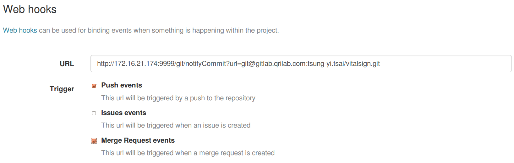
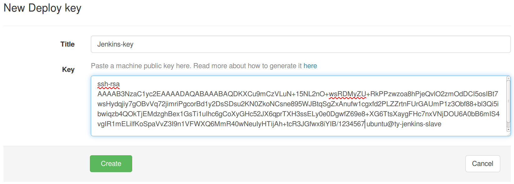
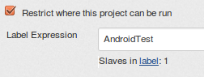
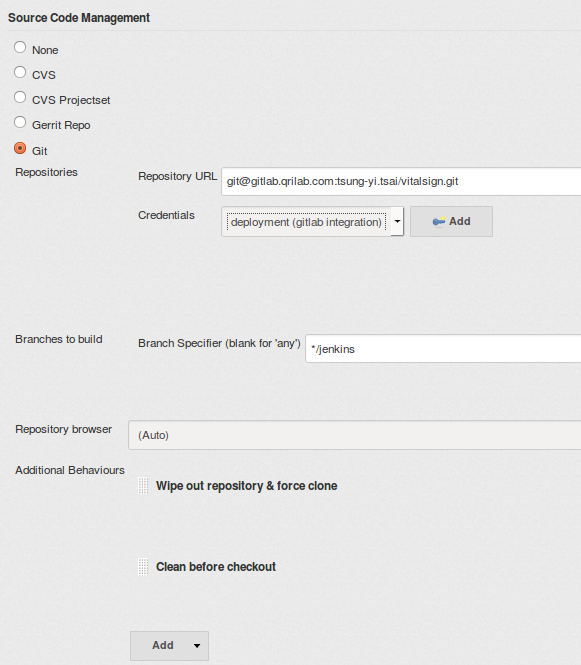
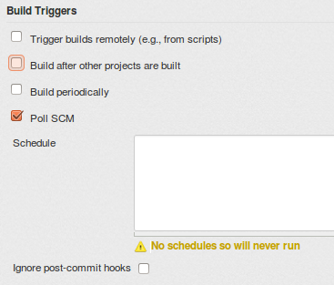
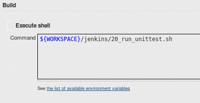
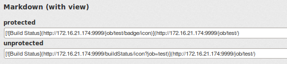
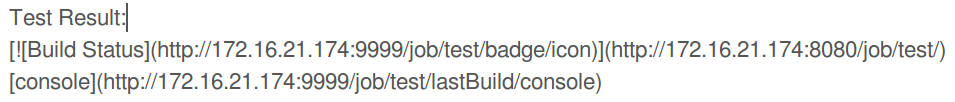
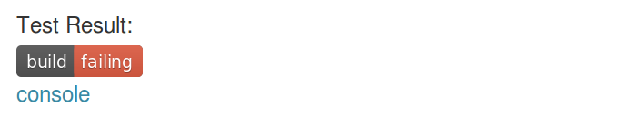

Gitlab + Jenkins -  User Guild
================================

Set up Gitlab server
--------------------

#### Web Hooks

- **URL:** `http://<Jenkins Server IP>/git/notifyCommit?url=<URL of the Git repository>[&branches=branch1[,branch2]*][&sha1=<commit ID>]`. please refer: https://wiki.jenkins-ci.org/display/JENKINS/Git+Plugin
- **Trigger:**  Select `Push event` and `Merge Request events`

#### Deploy keys

 enable deployment key

 

Create New Jenkins Job
-----------------------

#### create freestyle project

#### Restrict build slave

input *"AndroidTest"* to Label field.

#### Source Code Management

Input the Gitlab Project Repository URL & Branch.

Credential: select **"deployment"**

#### Build Triggers:

select `Poll SCM`

#### Build Command

use execute shell to run your test scripts

command reference for android:
- Gradle: http://tools.android.com/tech-docs/new-build-system/user-guide
- adb: http://developer.android.com/tools/help/adb.html

 

(Optional) Add Jenkins Job Status to Project's Wiki
---------------------------------------------------

**On Jenkins:**

Open the job page:

--> on the left sidebar, click the *"Embeddable Build Status"*

--> Copy the *"unprotected link path"* in *Markdown (with view)*. The link is similar to ``

**On Gitlab:**

Open the wiki page of your project.

--> paste the *"unprotected link path"* on the new wiki page to see the jobs result.

--> Also paste `http://[jenkins_server]/job/[job-name]/lastBuild/console` to link to the console output quickly.

result is simlilar to this:

