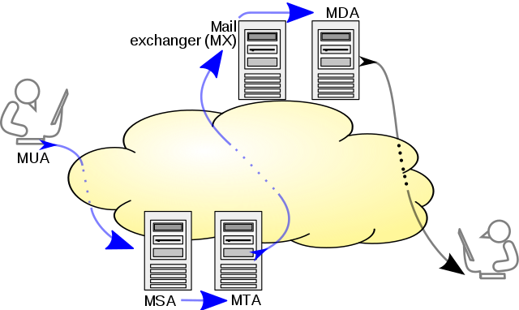

# SMTP (Simple Mail Transfer Protocol)

A TCP/IP protocol used in sending and receiving e-mail.

Communication between mail servers uses TCP port 25 (tranditional) and 587 (recently)

**SMTPS**: SMTP connections secured by TLS

 
## Transfet Model

- MUA (mail user agent): 
    - mail client 
- MSA (mail submission agent): 
    - receives mail messages from a MUA from TCP port 25 or 587
    - delivers the mail to its MTA
- MTA (mail transfer agent)
    - uses the DNS to look up the *MX record (mail exchanger record)* for the recipient's domain (the part of the email address on the right of @).
    - final MTA server hands the message to a MDA for local delivery. 
- MDA (mail delivery agent):
    - delivery of e-mail messages to a local recipient's mailbox.
    - Also called an LDA, or local delivery agent

Mail is retrieved by end-user applications, called email clients, using *IMAP* or *POP*

- **IMAP** (Internet Message Access Protocol):
    -  **always syncs**:  any changes you make in your mail client will instantly appear on your webmail inbox.
- **POP** (Post Office Protocol):
    - **not synced**: whatever changes you make to your email account in the mail client will not be transferred to the webmail inbox.
    - typically uses the traditional mbox mail file format or a proprietary system such as Microsoft Exchange/Outlook
