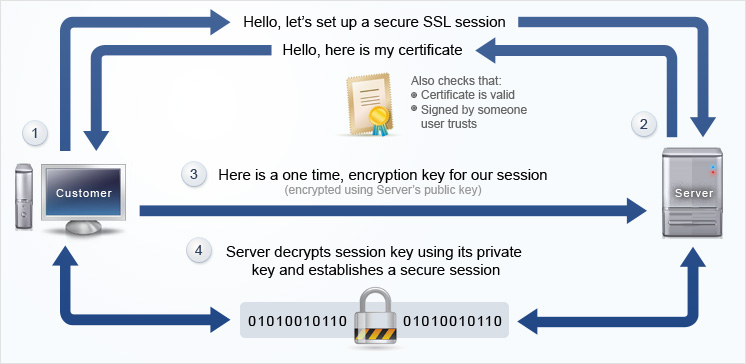

# SSL Certification



**TLS (Transport Layer Security)**: an updated, more secure, version of SSL. 


## Self-sigh certification

```
openssl req -x509 -newkey rsa:4096 -keyout privatekey.pem -out cert.pem -days 365
```